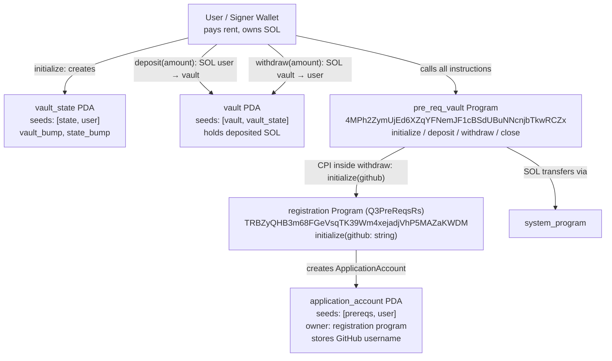

# Vault Program — Architecture

Audience: a new engineer joining the project. This explains the accounts,
instructions, cross-program call, and how state changes over time.

## Diagram (Mermaid)

## How it works

### Accounts
- **User** — the signer wallet. Pays rent and tx fees, and owns the deposited SOL.
- **vault_state** (PDA, seeds `[b"state", user]`) — stores `vault_bump` and
  `state_bump` so the program can re-derive the `vault` PDA.
- **vault** (PDA, seeds `[b"vault", vault_state]`) — a system account that simply
  holds the user's deposited SOL.
- **application_account** (PDA, seeds `[b"prereqs", user]`, owned by the
  registration program) — created during `withdraw` and stores the cadet's
  GitHub username on-chain.
- **application_program** — the external `registration` program
  (`TRBZyQHB3m68FGeVsqTK39Wm4xejadjVhP5MAZaKWDM`).
- **system_program** — used for the SOL transfers (`transfer` CPI).

### Instructions
1. **initialize** — creates `vault_state` and records both bumps.
2. **deposit(amount)** — transfers `amount` SOL from `user` into `vault`.
3. **withdraw(amount)** — transfers `amount` SOL from `vault` back to `user`
   (the `vault` PDA signs via `vault_bump`), then performs a **CPI** to the
   registration program's `initialize(github)` to record the cadet's GitHub
   username in `application_account`.
4. **close** — returns all remaining SOL from `vault` to `user` and closes
   `vault_state`.

### State over time
Nothing → `initialize` (vault_state exists) → `deposit` (vault funded) →
`withdraw` (SOL returned + registration records GitHub) → `close` (SOL returned,
vault_state closed).

### The CPI (key extension)
The `withdraw` instruction now calls `registration::cpi::initialize` with the
cadet's GitHub username. This is why, after a successful withdrawal, the
registration program holds the cadet's details — proving the vault program was
extended as required.
